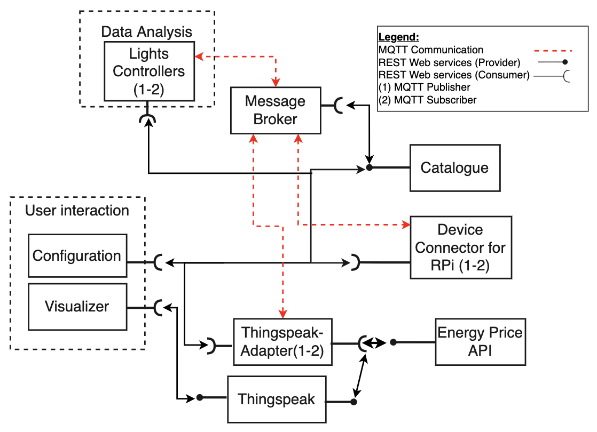

# Readme on S.L.I.M IoT
S.L.I.M will control lights in an industrial setting based on energy prices and presence detection. The lights in different rooms will be controlled by motion sensors, where the turn-off timer when no motion is detected is based on how high the energy prices are at the moment (higher prices = shorter timer). The user will be able to add new rooms and configure settings such as minimum time before the lights can be turned off.
All relevant information will also be visualised to the user (e.g. energy prices, energy consumption, light status of each room and the current settings).

Due to COVID restrictions, all sensor data is simulated. In addition, and energy price API is created to simulate the fluctuation of electricity prices. A "Thingspeak" service is used as the main database. 

## Complete description of the system



For the development of the Smart Light Industrial Management, two communication paradigms are used:

- Publisher - Subscriber, realised via MQTT protocol.
- Request - Response, realised via REST Web Services.


## Docker compose
To start all services from S.L.I.M the docker compose file is used. Go to the directory of the project and run following command in terminal: 

    docker-compose up -d

In order to see outputs from services remove `-d` from the command. Further more since all modules of the IoT project is running on the same computer a network bridge in order to enable communication between containers. 
The configuration of the network and the different services is located in `docker-compose.yml`


## Catalogue server
Serves as a Service and Resource Catalogue. It registers devices and can provide services, such as providing access to the resources and devices available in the system. Every actor is connected to the Catalogue for a particular reason. Devices request to be registered, applications request service and device registrations. MQTT topics are also stored in the Catalogue.

The catalogue has the following I.P and port:

    URI = http://0.0.0.0
    port = 8080

### The Catalogue API
The catalogue server REST-API consists of the following endpoints: 
#### GET
The GET endpoint is used for getting a device list, the configuration for the MQTT broker and MQTT topics.

	http://0.0.0.0:8080/GET/TOPICS

#### POST
In order to add or delete a device the devices information to be added/deleted must be part of the payload:

```python
payload = {'deviceType':'actuator','id':'345','building':'factory','floor':'34','room':'0'}
```

To utilize the PUT endpoint the following URI is used for adding devices:

    http://0.0.0.0:8080/API/ADDDEVICE?deviceType=actuator&id=345&building=factory&floor=34&room=0

Or with the requests module define the payload as a dict: 

```python
payload = {'deviceType':'actuator','id':'345','building':'factory','floor':'34','room':'0'}
r = requests.put('http://0.0.0.0:8080/API/ADDDEVICE', data=payload)
```
To delete a device do the use the following PUT endpoint: 

    http://127.0.0.1:8080/API/DELETE?deviceType=actuator&id=345&building=factory&floor=34&room=0

and with the requests module: 

```python
payload = {'deviceType':'actuator','id':'345','building':'factory','floor':'34','room':'0'}
r = requests.put('http://0.0.0.0:8080/API/ADDDEVICE', data=payload)
```

## Thingspeak
The thingspeak module is used as an adapter between the Thingspeak API and the MQTT broker.
It visualizes the history of the energy prics, energy consumption, and energy costs.
To calculate the energy costs, the following light source is used as a reference (uses 0.214 kW per hour):

	https://cdn.shopify.com/s/files/1/0135/1827/4660/files/VHA1.pdf?62663

The graphs generated by Thingspeak are embedded on the website:

	http://0.0.0.0:8080/graphs

## User-Interaction
The user interaction module is used to add and delete devices.

It utilizes a telegram bot for easy interaction by the user. 
To contact the bot, open Telegram and send the commands to:

    slim_iot_bot

Example messages in order to add a device:

    /addDevice deviceType = sensor, id = 10, building = main, floor = 4, room = 3
    /addDevice deviceType = actuator, id = 10, building = main, floor = 4, room = 3

Example messages in order to remove a device:

    /removeDevice deviceType = sensor, id = 10, building = main, floor = 4, room = 3
    /removeDevice deviceType = actuator, id = 10, building = main, floor = 4, room = 3

To visualize the current energy prices, energy costs, and energy consumption the following command provides a link to a webpage with graphs:

    /graphs

To obtain a list of the currently active devices (actuators/sensors) the following command provides a link to a webpage with that:

    /deviceLocations
    
## Energy Price API

The current electricity price is simulated via an API, which can be accessed through a REST GET command. The result is returned in a json form with the following structure:

	{"price_in_kWh": 0.269, "currency": "EUR", "date": "18/01/2022"}

For testing and debugging purposes, three mechanisms for computing the "price_in_kWh" are implemented. They can be accessed via the following URIs:
	
1) Random electricity price centered at the average EU price

Returns the simulated electricity price, computed from a uniform distribution around the average EU electricity price as of 14/01/2021

	http://0.0.0.0:8080/get/prices
	
	
2) Random electricity price centered lower than the average EU price

Returns a lower simulated electricity price, computed from a uniform distribution lower than the average EU electricity price (intended for test/debug purposes)

	http://0.0.0.0:8080/get/lowprices
	

	
3) Random electricity price centered higher than the average EU price

Returns a higher simulated electricity price, computed as a uniform distribution higher than the average EU electricity price (intended for test/debug purposes)

	http://0.0.0.0:8080/get/highprices 
	


## Device Simulator
Upon running main.py the device simulator initializes the ActuatorHandler and the SensorHandler. The handlers requests the current actuator/sensor topics from the catalouge and creates a new sensor/actuator object for each topic. The main loop then checks if any devices have been added/removed, and subsequently adds/removes a new sensor/actuator object.

The main loop in device simulation sends sensor data every 20 seconds, the data simply turn the sensor off or on randomly (30 % chance to detect movement). 

## Light Controller
When main.py is ran, the Light Controller class is initialized, with all the necessary constructor arguments:
	- devices_uri - REST end point for obtaining a json string with all avalable devices
	- topics_uri - REST end point for obtaining a json string with all avalable topics
	- prices_uri - REST end point for obtaining a json string with the current electricity prices
	- clientID - a unique client ID
	- broker - MQTT broker 
	- port - MQTT broker port

Using the devices and topics, the algorithm identifies which sensors and which actuators are in the same room, and groups them together. This is crucial, since all actuators (lights) in one room must be turned on even if only one of the several motion sensors is triggered. 

When none of the sensors in a room detect motion, a timer for that room is started. When the timer is out, the lights will be turned off, unless one of the sensors registered motion in the mean time. The duration of the timer depends on the current electricity prices. If the price is above a certain threshold, a shorter timer duration is used. The threshold and the durations have default values, but can also be set via the following command:

	set_timers(short_timer_duration, long_timer_duration, threshold)

Then, using the data from the motion sensors obtained over MQTT, it triggers the timer and updates the light status for each room. The light status is then published over MQTT so it can be used by the Visualiser and by the Device manager, which controls the lights.

All the setup is done in the constructor, and all the sensor data handling, calculation and publishing is done via the command "control_the_lights()".


## MQTT broker
Manages the MQTT Publishers and Subscribers by distributing the messages on the corresponding topics and to the actors subscribed to them. 
The MQTT broker used in the project is an mosquitto broker implemented locally. This means that it is nessesarry to use the following address when connecting to the broker inside the docker environment: 

    IP: 172.15.10.5
    port: 1883

For connecting to the broker externally the host IP is needed which can be found in terminal(MAC)

   $ ifconfig

For connecting locally use localhost as IP. 


## Visualiser

The visualiser is a simple subscriber, which subscribes to all MQTT topics regarding sensors and actuators and shows their values in a terminal as shown below:

	-------------- ACTUATORS ------------------
	-------ID--------------------STATUS--------
	------light1------------------False-----
	------light2------------------True-----
	--------------- SENSORS -------------------
	-------ID--------------------STATUS--------
	------sens1------------------False-----
	------sens2------------------True-----


